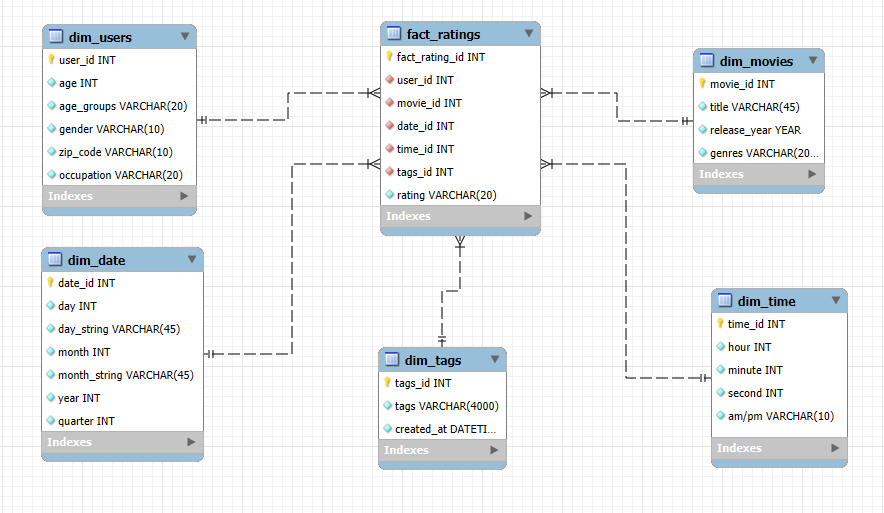
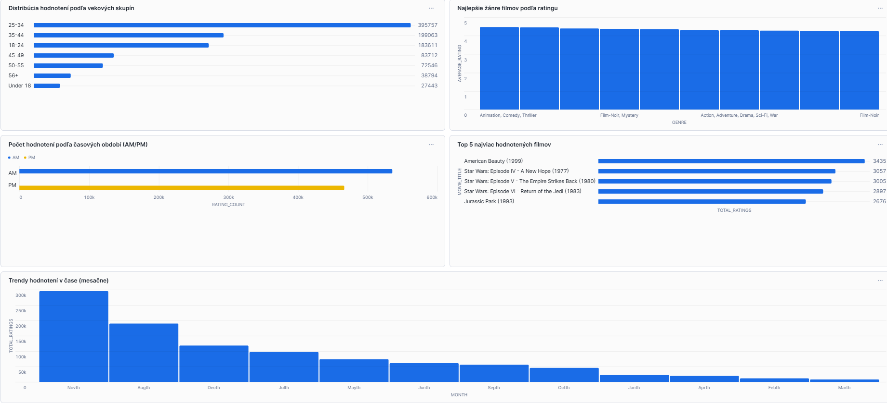

# Téma projektu
Táto téma sa zaoberá analýzou filmových hodnotení a odporúčaní na základe dát z MovieLens datasetu. MovieLens poskytuje informácie o filmoch, ich žánroch a hodnoteniach od používateľov, čo umožňuje skúmať vzťahy medzi preferenciami divákov a vlastnosťami filmov. 
___
## 1. Úvod a popis zdrojových dát


Cieľom semestrálneho projektu je identifikácia najviac hodnotených a najlepšie hodnotených filmov, analýza preferencií užívateľov na základe ich demografie a vytvorenie modelu odporúčania filmov.

### Popis tabuliek

`movies` obsahuje zoznam filmov, pričom každý film má unikátny identifikátor, ktorý sa nazýva "id" a slúži na jednoznačnú identifikáciu filmu. Názov filmu je uložený v stĺpci "title" a rok vydania filmu je zaznamenaný v stĺpci "release_year".

`genres` uchováva zoznam žánrov filmov. Každý žáner má unikátny identifikátor "id", ktorý slúži na jeho identifikáciu, a názov žánru je uložený v stĺpci "name".

`genres_movies` prepája filmy a ich žánre, čím vytvára many-to-many vzťah. Každý záznam má unikátny identifikátor "id". Stĺpec "movie_id" odkazuje na identifikátor filmu v tabuľke Movies, zatiaľ čo stĺpec "genre_id" odkazuje na identifikátor žánru v tabuľke Genres.

`ratings` obsahuje informácie o hodnoteniach filmov od užívateľov. Každé hodnotenie má unikátny identifikátor "id". Stĺpec "user_id" odkazuje na identifikátor užívateľa v tabuľke Users a "movie_id" odkazuje na identifikátor hodnoteného filmu v tabuľke Movies. Hodnota hodnotenia je zaznamenaná v stĺpci "rating" a čas, kedy bolo hodnotenie priradené, je uložený v stĺpci "rated_at".

`tags` uchováva užívateľské štítky (tagy) priradené k filmom. Každý štítok má unikátny identifikátor "id". Stĺpec "user_id" odkazuje na identifikátor užívateľa v tabuľke Users a "movie_id" na identifikátor filmu v tabuľke Movies. Text štítku je uložený v stĺpci "tags" a čas priradenia štítku v stĺpci "created_at".

`users` obsahuje informácie o užívateľoch. Každý užívateľ má identifikátor "id", ktorý ho jednoznačne identifikuje. Vek užívateľa je zaznamenaný v stĺpci "age", pohlavie v stĺpci "gender" a PSČ v stĺpci "zip_code". Stĺpec "occupation_id" odkazuje na identifikátor zamestnania v tabuľke Occupations.

`occupations` obsahuje zoznam zamestnaní. Každé zamestnanie má unikátny identifikátor "id" a jeho názov je zaznamenaný v stĺpci "name".

`age_group` slúži na kategorizáciu vekových skupín. Každá veková skupina má unikátny identifikátor "id" a jej názov je uvedený v stĺpci "name".

### ERD diagram


<p align="center"><i>Obrázok 1 Entitno-relačná schéma MovieLens</i></p>

___

## 2. Dimenzionálny model
### Faktorová tabuľka: `fact_ratings`
### Hlavné metriky:
- rating
### Klúče v tabuľke `fact_ratings`:
- **fact_rating_id** - Primárny klúč tabuľky.
- **user_id** - Cudzí klúč, ktorý odkazuje na tabuľku `dim_users`.
- **date_id** - Cudzí klúč, ktorý odkazuje na tabuľku `dim_date`.
- **tags_id** - Cudzí klúč, ktorý odkazuje na tabuľku `dim_tags`.
- **time_id** - Cudzí klúč, ktorý odkazuje na tabuľku `dim_time`.
- **movie_id** - Cudzí klúč, ktorý odkazuje na tabuľku `dim_movies`.

### Dimenzionálne tabuľky:

`dim_users` 
- Obsahuje údaje o používateľoch (vek, veková skupina, pohlavie, poštové identifikačné číslo, pohlavie).
- #### Typ dimenzie: SCD 2, pretože sa údaje môžu meniť.
<br>

`dim_date`
- Obsahuje údaje o dátume (deň - int, deň - string, mesiac - int, mesiac - string, rok, štvrťrok).
- #### Typ dimenzie: SCD 1, pretože sú údaje nemenné.
<br>

`dim_tags`
- Obsahuje údaje o popise filmu (popis, dátum vytvorenia).
- #### Typ dimenzie: SCD 1, pretože sú údaje nemenné.
<br>

`dim_time`
- Obsahuje údaje o čase v daný deň (sekunda, minúta, hodina, ráno/poobede).
- #### Typ dimenzie: SCD 1, pretože sú údaje nemenné.
<br>

`dim_movies`
- Obsahuje údaje o filme (názov, rok vydania, žáner).
- #### Typ dimenzie: SCD 1, pretože sú údaje nemenné.
<br>


<p align="center"><i>Obrázok 2 Schéma hviezdy pre MovieLens</i></p>

___
## 3. ETL proces v Snowflake

Proces ETL pozostával z troch základných krokov: získavanie údajov (Extract), ich spracovanie a transformácia (Transform) a následné nahrávanie (Load). Tento proces bol realizovaný v prostredí Snowflake s cieľom upraviť zdrojové dáta zo staging vrstvy do podoby viacdimenzionálneho modelu, ktorý umožňuje efektívnu analýzu a vizualizáciu.

### Extract (Extrahovanie dát)

Zdrojové dáta v `.csv` formáte boli importované do Snowflaku pomocou interného stage úložiska nazvaného `my_stage`.

- **Príkaz na vytvorenie `my_stage` úložiska, ktoré slúži na dočasné uloženie súborov, ako sú napríklad CSV súbory, pred ich následným spracovaním.**
```sql
CREATE OR REPLACE STAGE my_stage;
```

- **Príkaz na načítanie dát do staging tabuliek:**
```sql
COPY INTO users_staging
FROM @my_stage/users.csv
FILE_FORMAT = (TYPE = 'CSV' FIELD_OPTIONALLY_ENCLOSED_BY = '"' SKIP_HEADER = 1);
```

### Transform (Transformácia dát)
V tejto fáze boli dáta zo staging tabuliek upravené, vyčistené a obohatené s cieľom pripraviť dimenzie a faktovú tabuľku, ktoré umožnia efektívnu analýzu. 
Dimenzie boli navrhnuté tak, aby poskytovali potrebný kontext pre faktovú tabuľku.

**Vytvorili sme viaceré dimenzie:**

- `dim_users` 
```sql
CREATE TABLE dim_users AS
SELECT DISTINCT
    u.id AS user_id,
    u.age AS age,
    ag.name AS age_groups,    
    u.gender AS gender,
    u.zip_code AS zip_code,
    o.name AS occupation
FROM users_staging u
LEFT JOIN age_group_staging ag ON u.age = ag.id
LEFT JOIN occupations_staging o ON u.occupation_id = o.id;
```
**Účel:** Tento príkaz vytvára dimenziu `dim_users`, ktorá obsahuje informácie o používateľoch, ako vek, pohlavie, zamestnanie a poštový kód. Využíva sa pripojenie (LEFT JOIN) k staging tabuľkám na získanie ďalších atribútov ako vekové kategórie a zamestnania.

<br>

- `dim_movies` 
```sql
CREATE TABLE dim_movies AS
SELECT DISTINCT
 m.id AS movie_id,
 m.title AS title,
m.release_year AS release_year,
LISTAGG(g.name, ', ') WITHIN GROUP (ORDER BY g.name) AS genres
FROM movies_staging m
LEFT JOIN movie_genre_relationship_staging mgr ON m.id = mgr.movie_id
LEFT JOIN movie_genres_staging g ON mgr.genre_id = g.id
GROUP BY m.id, m.title, m.release_year;
```
**Účel:** Tento príkaz vytvára dimenziu `dim_movies`, ktorá obsahuje informácie o filmoch, ako ID, názov, rok vydania a zoznam žánrov. Používa sa agregácia (LISTAGG) na zoskupenie žánrov podľa filmu.

<br>

- `dim_date` 
```sql
CREATE TABLE dim_date AS
SELECT DISTINCT
    CAST(DATE(r.rated_at) AS STRING) AS date_id,
    EXTRACT(DAY FROM r.rated_at) AS day,
    TO_CHAR(r.rated_at, 'Day') AS day_string,
    EXTRACT(MONTH FROM r.rated_at) AS month,
    TO_CHAR(r.rated_at, 'Month') AS month_string,
    EXTRACT(YEAR FROM r.rated_at) AS year,
    CEIL(EXTRACT(MONTH FROM r.rated_at) / 3.0) AS quarter
FROM ratings_staging r;

```
**Účel:** Tento príkaz vytvára dimenziu `dim_date`, ktorá poskytuje informácie o dátumoch na základe hodnotenia filmu. Využíva sa extrakcia rôznych časových jednotiek (deň, mesiac, rok, štvrťrok).

<br>

- `dim_time` 
```sql
CREATE TABLE dim_time AS
SELECT DISTINCT
    TO_CHAR(r.rated_at, 'HH24:MI:SS') AS time_id,
    EXTRACT(HOUR FROM r.rated_at) AS hour,
    EXTRACT(MINUTE FROM r.rated_at) AS minute,
    EXTRACT(SECOND FROM r.rated_at) AS second,
    CASE 
        WHEN EXTRACT(HOUR FROM r.rated_at) < 12 THEN 'AM' 
        ELSE 'PM' 
    END AS am_pm
FROM ratings_staging r;
```
**Účel:** Tento príkaz vytvára dimenziu `dim_time`, ktorá obsahuje časové informácie o hodnotení, vrátane hodiny, minúty, sekundy a AM/PM označenia.

<br>

- `dim_tags` 
```sql
CREATE TABLE dim_tags AS
SELECT DISTINCT
    t.id AS tags_id,
    t.tags AS tags,
    t.created_at AS created_at
FROM tags_staging t;
```
**Účel:** Tento príkaz vytvára dimenziu `dim_tags`, ktorá obsahuje informácie o tagoch priradených k hodnoteniam, vrátane ID tagu, názvu tagu a dátumu vytvorenia.

<br>

- `fact_ratings` 
```sql
CREATE TABLE fact_ratings AS
SELECT DISTINCT
    r.id AS fact_rating_id,
    r.user_id AS user_id,
    r.movie_id AS movie_id,
    TO_CHAR(r.rated_at, 'YYYY-MM-DD') AS date_id,
    TO_CHAR(r.rated_at, 'HH24:MI:SS') AS time_id,
    t.id AS tags_id,
    r.rating AS rating
FROM ratings_staging r
LEFT JOIN tags_staging t 
    ON r.user_id = t.user_id AND r.movie_id = t.movie_id;
```
**Účel:** Tento príkaz vytvára faktovú tabuľku `fact_ratings`, ktorá obsahuje hodnotenia filmov používateľmi, spojené s príslušnými dátumami, časmi a tagmi. Používa sa pripojenie (LEFT JOIN) na získanie tagov spojených s hodnoteniami.

### Load (Načítanie dát)
Po úspešnom vytvorení dimenzií a faktovej tabuľky boli dáta presunuté do finálnej štruktúry. Na záver boli staging tabuľky vymazané s cieľom optimalizovať využitie úložného priestoru.

- **Príkaz na vymazanie staging tabuliek:**

```sql
DROP TABLE IF EXISTS age_group_staging;
DROP TABLE IF EXISTS movie_genres_staging;
DROP TABLE IF EXISTS movie_genre_relationship_staging;
DROP TABLE IF EXISTS movies_staging;
DROP TABLE IF EXISTS occupations_staging;
DROP TABLE IF EXISTS ratings_staging;
DROP TABLE IF EXISTS tags_staging;
DROP TABLE IF EXISTS users_staging;
```
___
## 4. Vizualizácia dát
Na dashboarde sú zobrazené grafy, ktoré poskytujú prehľad o hodnoteniach filmov zameraných na vekové skupiny, žánre, časové obdobia, najviac hodnotené filmy a trendy v priebehu času. Umožňujú analyzovať, ktoré vekové skupiny a žánre sú najaktívnejšie pri hodnotení, a identifikovať, kedy a ktoré filmy získavajú najviac pozornosti. Pomáhajú tak lepšie pochopiť správanie používateľov a identifikovať predajné a hodnotiace trendy, čo je kľúčové pre optimalizáciu marketingových a obchodných stratégií.

<br>


<p align="center"><i>Obrázok 3 Screenshot dashboardu pre MovieLens</i></p>

<br>

### 1. Graf: Distribúcia hodnotení podľa vekových skupín
Tento príkaz ukazuje, ktoré vekové skupiny hodnotia filmy najčastejšie. Porovnáva počet hodnotení medzi rôznymi vekovými skupinami.

```sql
SELECT 
    du.age_groups AS age_group, 
    COUNT(fr.fact_rating_id) AS rating_count
FROM fact_ratings fr
JOIN dim_users du ON fr.user_id = du.user_id
GROUP BY du.age_groups
ORDER BY rating_count DESC;
```

### 2. Graf: Najlepšie hodnotené žánre filmov
Tento príkaz určuje, ktoré filmové žánre majú najvyššie priemerné hodnotenie. Umožňuje identifikovať, ktoré žánre sú preferované a vysoko hodnotené.

```sql
SELECT 
    dm.genres AS genre, 
    AVG(fr.rating) AS average_rating
FROM fact_ratings fr
JOIN dim_movies dm ON fr.movie_id = dm.movie_id
GROUP BY dm.genres
ORDER BY average_rating DESC
LIMIT 10;
```

### 3. Graf: Počet hodnotení podľa časových období (AM/PM)
Tento príkaz ukazuje, či používatelia častejšie hodnotia filmy dopoludnia (AM) alebo popoludní (PM), čo odhaľuje, kedy je najväčší záujem o hodnotenie.

```sql
SELECT 
    dt.am_pm AS time_period, 
    COUNT(fr.fact_rating_id) AS rating_count
FROM fact_ratings fr
JOIN dim_time dt ON fr.time_id = dt.time_id
GROUP BY dt.am_pm
ORDER BY rating_count DESC;
```

### 4. Graf: Top 5 najviac hodnotených filmov
Tento príkaz ukazuje, ktoré filmy dostali najviac hodnotení. Zameriava sa na najpopulárnejšie filmy, ktoré získali najväčší záujem od používateľov.

```sql
SELECT 
    dm.title AS movie_title, 
    COUNT(fr.fact_rating_id) AS total_ratings
FROM fact_ratings fr
JOIN dim_movies dm ON fr.movie_id = dm.movie_id
GROUP BY dm.title
ORDER BY total_ratings DESC
LIMIT 5;
```

### 5. Graf: Trendy hodnotení v čase (mesačne)
Tento príkaz zobrazuje, ako sa počet hodnotení vyvíja počas mesiacov. Umožňuje sledovať sezónne alebo dlhodobé trendy v hodnoteniach filmov.

```sql
SELECT 
    dd.month_string AS month, 
    COUNT(fr.fact_rating_id) AS total_ratings
FROM fact_ratings fr
JOIN dim_date dd ON fr.date_id = dd.date_id
GROUP BY dd.month_string, dd.month
ORDER BY dd.month ASC;
```
___

**Autor:** Erik Pauček
